```{r setup, include=FALSE}
options(htmltools.dir.version = FALSE)
```

```{r, message=FALSE, warning=FALSE, echo=FALSE}
library(tidyverse)
library(gganimate)
library(gapminder)
library(NHANES)
library(datasets)
library(knitr)
library(kableExtra)
library(visdat)
library(Hmisc)
library(broom)
library(gridExtra)
library(readxl)
library(ggthemes)
library(tidytext)
library(gutenbergr)
library(wordcloud)
library(rtweet)
library(leaflet)
library(RColorBrewer)
library(MASS)
library(ggthemes)
library(tools)
library(gganimate)
library(ggimage)
library(gifski)
library(png)
library(ggrepel)
```

class: center

# The following is a fully reproducible talk (just add my accent)

All slides and R code used to generate these slides available here:

https://github.com/ajstewartlang/SIPS_presentation

<br style=“line-height:2;”>

```{r, echo=FALSE, out.width="50%"}
knitr::include_graphics("images/ssi.png")
```

.footnote[
Slides created via the R package [**xaringan**](https://github.com/yihui/xaringan), [**knitr**](http://yihui.name/knitr), and [R Markdown](https://rmarkdown.rstudio.com).
]
---
class: center, middle

```{r, echo=FALSE, out.width="150%"}

```

---
# Open and Reproducible Research

Fully open and reproducible research requires:

--

<b>Shared data</b> - we need to share our data with others.

--

<b>Shared code</b> - we need to share our code with others. We need to ensure it's well
documented so that it is usable in conjunction with our data.

--

<b>Shared computational environment</b> - we need to share our computational 
environment with others. This includes our analysis software, the specific
packages we used, plus any system-level dependencies.

---
# Why do we need a shared computational environment?

Quite often analysis code ‘breaks’ - often in one of two ways:

--

Code that worked previously now doesn’t - maybe a function in an R package was 
updated (e.g., lsmeans became emmeans so old code using lsmeans wouldn’t now run).

--

Code that worked previously still works - but produces a slightly different 
result or now throws a warning where it didn’t previousy (e.g., convergence/
singular fit warnings in lme4 version 1.1-19 vs. version 1.1-20).

--

Arguably, sharing only your data and code means you are not engaging in fully 
reproducible research practices.

---
.center[
.middle[
```{r, echo=FALSE, out.width="100%"}
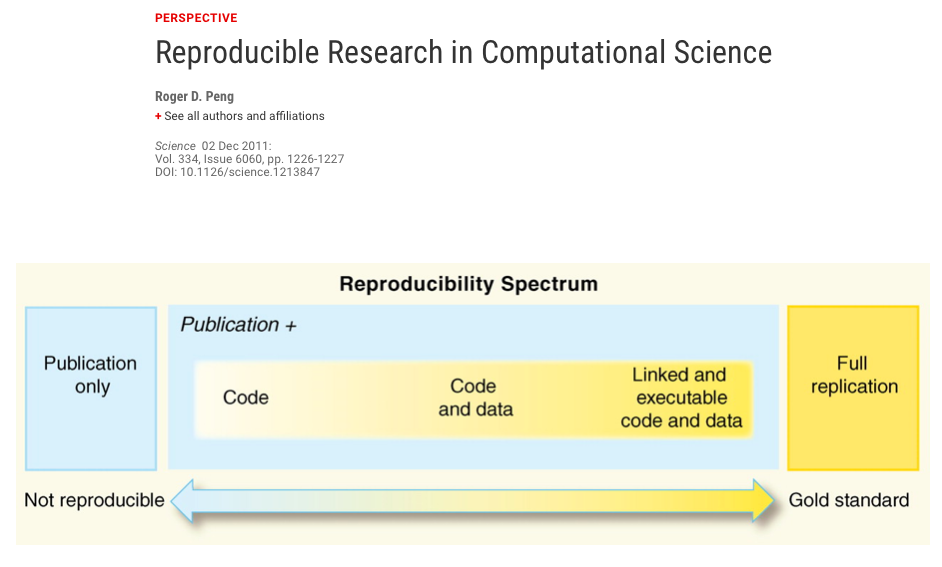
```
]
]
---
# Make your Visualizations Reproducible
"<i>(visualizations)</i> should be autogenerated as part of the data analysis 
pipeline (which should also be automated), and they should come out of the 
pipeline ready to be sent to the printer...

...the moment you manually edit a figure, your final figure becomes 
irreproducible. A third party cannot generate the exact same figure you did."

.pull-left[
.center[
```{r, echo=FALSE, out.width=200}
knitr::include_graphics("images/wilke.png")
```
]
]

.pull-right[
<i>Claus Wilke, Fundamentals of Data Visualization (2019). Page xiii.</i>
]

---
class: center, middle

```{r, echo=FALSE}
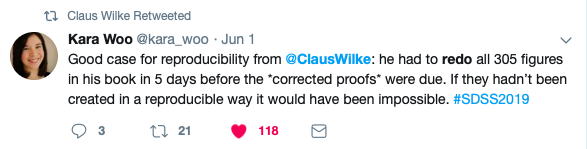
```

---
# A workflow for reproducible science in the Tidyverse

.center[
```{r, echo=FALSE, out.width="90%"}
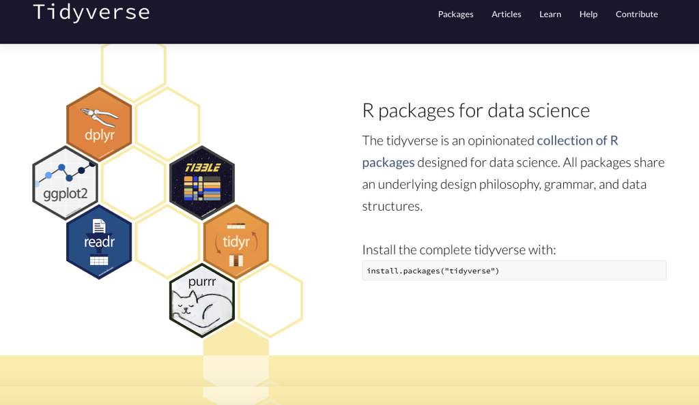
```
]
---
# A workflow for reproducible science in the Tidyverse

```{r, echo=FALSE}
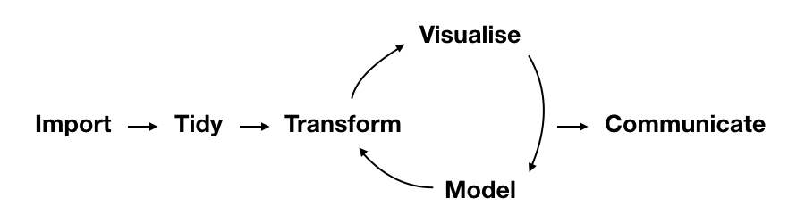
```

https://www.tidyverse.org

---
class: center, middle
# Why Data Visualization is Important
---
class: center, middle
# Anscombe's Quartert
---
# Plot 1
.pull-left[
```{r, echo=FALSE}
anscombe %>%
  ggplot(aes(x = x1, y = y1)) +
  geom_point(size = 5) +
  geom_smooth(method = "lm", se = FALSE) +
  labs(x = "X", y = "Y") +
  theme_grey(base_size = 22) +
  ylim(3, 13) +
  xlim(3, 15)
```
]

.pull-right[
```{r, echo=FALSE}
paste0("Mean of X is: ", round(mean(anscombe$x1), 2))
paste0("SD of X is: ", round(sd(anscombe$x1), 2))
paste0("Mean of Y is: ", round(mean(anscombe$y1), 2))
paste0("SD of Y is: ", round(sd(anscombe$y1), 2))
```
]
```{r, echo=FALSE}
paste0("Pearson's r is ", round(tidy(rcorr(anscombe$x1, anscombe$y1))$estimate,2))
```

---
# Plot 2
.pull-left[
```{r, echo=FALSE}
anscombe %>%
  ggplot(aes(x = x2, y = y2)) +
  geom_point(size = 5) +
  geom_smooth(method = "lm", se = FALSE) +
  labs(x = "X", y = "Y") +
  theme_grey(base_size = 22) +
  ylim(3, 13) +
  xlim(3, 15)
```
]
.pull-right[
```{r, echo=FALSE}
paste0("Mean of X is: ", round(mean(anscombe$x2), 2))
paste0("SD of X is: ", round(sd(anscombe$x2), 2))
paste0("Mean of Y is: ", round(mean(anscombe$y2), 2))
paste0("SD of Y is: ", round(sd(anscombe$y2), 2))
```
]
```{r, echo=FALSE}
paste0("Pearson's r is ", round(tidy(rcorr(anscombe$x2, anscombe$y2))$estimate,2))
```

---
# Plot 3
.pull-left[
```{r, echo=FALSE}
anscombe %>%
  ggplot(aes(x = x3, y = y3)) +
  geom_point(size = 5) +
  geom_smooth(method = "lm", se = FALSE) +
  labs(x = "X", y = "Y") +
  theme_grey(base_size = 22) +
  ylim(3, 13) +
  xlim(3, 15)
```
]
.pull-right[
```{r, echo=FALSE}
paste0("Mean of X is: ", round(mean(anscombe$x3), 2))
paste0("SD of X is: ", round(sd(anscombe$x3), 2))
paste0("Mean of Y is: ", round(mean(anscombe$y3), 2))
paste0("SD of Y is: ", round(sd(anscombe$y3), 2))
```
]
```{r, echo=FALSE}
paste0("Pearson's r is ", round(tidy(rcorr(anscombe$x3, anscombe$y3))$estimate,2))
```

---
# Plot 4
.pull-left[
```{r, echo=FALSE}
anscombe %>%
  ggplot(aes(x = x4, y = y4)) +
  geom_point(size = 5) +
  geom_smooth(method = "lm", se = FALSE) +
  labs(x = "X", y = "Y") +
  theme_grey(base_size = 22) +
  ylim(3, 13) +
  xlim(3, 20)
```
]
.pull-right[
```{r, echo=FALSE}
paste0("Mean of X is: ", round(mean(anscombe$x4), 2))
paste0("SD of X is: ", round(sd(anscombe$x4), 2))
paste0("Mean of Y is: ", round(mean(anscombe$y4), 2))
paste0("SD of Y is: ", round(sd(anscombe$y4), 2))
```
]
```{r, echo=FALSE}
paste0("Pearson's r is ", round(tidy(rcorr(anscombe$x4, anscombe$y4))$estimate,2))
```

---
# Plots Based on Aggregated Data Can Mislead…

```{r, echo=FALSE}
Subject <- seq(1:80)
Group <- factor(rep(1,80))
set.seed(1234)
RT <- c(rnorm(40,500,200), rnorm(40,1900,200))
data1 <- tibble(Subject, Group, RT)
```

.center[
```{r, fig.height = 5}
ggplot(data1, aes(x = Group, y = RT)) + geom_boxplot() 
```
]
---
# But look more closely at the actual data…

.center[
```{r, echo=FALSE}
p1 <- ggplot(data1, aes(x = Group, y = RT)) + geom_jitter(size = 2, width = .1, alpha = .5)
p2 <- ggplot(data1, aes(x = Group, y = RT)) + geom_boxplot() + geom_jitter(size = 2, width = .1, alpha = .5)
p3 <- ggplot(data1, aes(x = Group, y = RT)) + geom_violin() + geom_jitter(width = .1, alpha = .75)
grid.arrange(p1, p2, p3, nrow = 1)
```
]
---
# The distribution of data matters

The data on the previous slide are clearly bimodal with no data point near the 
mean.  Distribution shape matters and we need to capture that in our data 
visualizations.

If we only plotted and reported information related to aggregated data, we 
wouldn't be being honest about what our data look like.
---
# Reasons for visualizing data

--

For yourself - once you have collected your data, you should visualize it 
before you build any statistical models - does the data look (roughly) as 
expected with the right number of data points?

--

For others - when you present your work in a talk, on a poster, or in a 
published paper you want the viewer to be able to quickly and unambiguously 
extract the intended meaning from your visualization.  

--

Just as the reproducibilty of statistical models is important in the context 
of engaging in open and reproducible science, so too is the reproducibilty of 
data visualizations.


---

# ggplot2

The ggplot2 package is part of the Tidyverse and is based on the layered Grammar of Graphics (Wickham, 2010):

https://byrneslab.net/classes/biol607/readings/wickham_layered-grammar.pdf

Start with defining your data and aesthetics of the plot, before adding geometric objects (geoms), information about labelling, faceting etc.

Each plot can be built up gradually, layer by layer like the following:

---
```{r, echo=FALSE}
set.seed(1234)
ID <- rep(seq(1:48), 2)
Simple <- as.integer(rnorm(48, mean = 2000, sd = 140))
Complex <- as.integer(rnorm(48, mean = 2400, sd = 160))
Condition <- c(rep("Simple", 48), rep("Complex", 48))
data_long <- tibble(ID, Condition, c(Simple, Complex))
colnames(data_long)[3] <- "RT"
```

.top[
```{r, echo=FALSE, fig.height=5}
ggplot(data_long, aes(x = Condition, y = RT)) +
  geom_jitter(alpha = .25, position = position_jitter(0.05)) +
  theme_grey(base_size = 22)
```
]

.bottom[
```{r, eval=FALSE}
ggplot(data_long, aes(x = Condition, y = RT)) +
  geom_jitter(alpha = .25, position = position_jitter(0.05))
```
]

---
.top[
```{r, echo=FALSE, fig.height=5}
ggplot(data_long, aes(x = Condition, y = RT)) +
  geom_jitter(alpha = .25, position = position_jitter(0.05)) +
  stat_summary(fun.data = "mean_cl_boot", colour = "black", 
               size = 1) +
  theme_grey(base_size = 22)
```
]

.bottom[
```{r, eval=FALSE}
ggplot(data_long, aes(x = Condition, y = RT)) +
  geom_jitter(alpha = .25, position = position_jitter(0.05)) +
  stat_summary(fun.data = "mean_cl_boot", colour = "black", 
               size = 1) 
```
]
---
.top[
```{r, echo=FALSE, fig.height=5}
ggplot(data_long, aes(x = Condition, y = RT)) +
  geom_jitter(alpha = .25, position = position_jitter(0.05)) +
  stat_summary(fun.data = "mean_cl_boot", colour = "black", 
               size = 1) +
  geom_violin(aes(fill = Condition), alpha = .2) +
  theme_grey(base_size = 22)
```
]

.bottom[
```{r, eval=FALSE}
ggplot(data_long, aes(x = Condition, y = RT)) +
  geom_jitter(alpha = .25, position = position_jitter(0.05)) +
  stat_summary(fun.data = "mean_cl_boot", colour = "black", 
               size = 1) +
  geom_violin(aes(fill = Condition), alpha = .2)
```
]
---
.top[
```{r, echo=FALSE, fig.height=5}
ggplot(data_long, aes(x = Condition, y = RT)) +
  geom_jitter(alpha = .25, position = position_jitter(0.05)) +
  stat_summary(fun.data = "mean_cl_boot", colour = "black", 
               size = 1) +
  geom_violin(aes(fill = Condition), alpha = .2) +
  guides(fill = FALSE) +
  theme_grey(base_size = 22)
```
]

.bottom[
```{r, eval=FALSE}
ggplot(data_long, aes(x = Condition, y = RT)) +
  geom_jitter(alpha = .25, position = position_jitter(0.05)) +
  stat_summary(fun.data = "mean_cl_boot", colour = "black", 
               size = 1) +
  geom_violin(aes(fill = Condition), alpha = .2) +
  guides(fill = FALSE)
```
]

---
.top[
```{r, echo=FALSE, fig.height=5}
ggplot(data_long, aes(x = Condition, y = RT)) +
  geom_jitter(alpha = .25, position = position_jitter(0.05)) +
  stat_summary(fun.data = "mean_cl_boot", colour = "black", 
               size = 1) +
  geom_violin(aes(fill = Condition), alpha = .2) +
  guides(fill = FALSE) +
  theme_grey(base_size = 22) + 
  coord_flip()
```
]

.bottom[
```{r, eval=FALSE}
ggplot(data_long, aes(x = Condition, y = RT)) +
  geom_jitter(alpha = .25, position = position_jitter(0.05)) +
  stat_summary(fun.data = "mean_cl_boot", colour = "black", 
               size = 1) +
  geom_violin(aes(fill = Condition), alpha = .2) +
  guides(fill = FALSE) + 
  coord_flip()
```
]

---
# Violin Plots

These are Violin Plots - these are an example of an RDI plot as they capture the Raw data, information about the Distribution, and some Inferential statistics (e.g., Confidence Intervals).

We can modify other characteristics of the plot such as the colour palette we're using, the orientation, and we can also add some labels:

```{r, echo=FALSE}
set.seed(1234)
ID <- rep(seq(1:48), 2)
Simple <- as.integer(rnorm(48, mean = 2000, sd = 140))
Complex <- as.integer(rnorm(48, mean = 2400, sd = 160))
Condition <- c(rep("Simple", 48), rep("Complex", 48))
data_long <- tibble(ID, Condition, c(Simple, Complex))

colnames(data_long)[3] <- "RT"
```

```{r, echo=FALSE, fig.height=4}
ggplot(data_long, aes(x = Condition, y = RT)) + 
  geom_violin(aes(fill = Condition)) + 
  geom_jitter(alpha = .25, position = position_jitter(0.05)) + 
  guides(fill = FALSE) +
  stat_summary(fun.data = "mean_cl_boot", colour = "black", 
               size = 1) +
  scale_fill_brewer(palette = "Accent") +
  coord_flip() +
  theme_grey(base_size = 22) +
  labs(x = "Condition", y = "Reaction Time (ms.)")
```
---
# Raincloud Plots
```{r, echo=FALSE, fig.height=5, fig.width=7}
source("https://gist.githubusercontent.com/ajstewartlang/6c4cd8ab9e0c27747424acdfb3b4cff6/raw/fb53bd97121f7f9ce947837ef1a4c65a73bffb3f/geom_flat_violin.R")

set.seed(1234)
ID <- rep(seq(1:48), 2)
Simple <- as.integer(rnorm(48, mean = 2000, sd = 140))
Complex <- as.integer(rnorm(48, mean = 2400, sd = 160))
Condition <- c(rep("Simple", 48), rep("Complex", 48))
data_long <- tibble(ID, Condition, c(Simple, Complex))

colnames(data_long)[3] <- "RT"

raincloud_theme = theme(
  text = element_text(size = 12),
  axis.title.x = element_text(size = 12),
  axis.title.y = element_text(size = 12),
  axis.text = element_text(size = 12),
  axis.text.x = element_text(angle = 45, vjust = 0.5),
  legend.title = element_text(size = 12),
  legend.text = element_text(size = 12),
  legend.position = "right",
  plot.title = element_text(lineheight = .8, face = "bold", size = 16),
  panel.border = element_blank(),
  panel.grid.minor = element_blank(),
  panel.grid.major = element_blank(),
  axis.line.x = element_line(colour = 'black', size = 0.5, linetype = 'solid'),
  axis.line.y = element_line(colour = 'black', size = 0.5, linetype = 'solid'))

lb <- function(x) mean(x) - sd(x)
ub <- function(x) mean(x) + sd(x)

sumld <- plyr::ddply(data_long, ~ Condition, summarise, mean = mean(RT), median = median(RT), 
               lower = lb(RT), upper = ub(RT))

ggplot(data_long, aes(y = RT, x = Condition, fill = Condition)) +
  geom_flat_violin(position = position_nudge(x = .2, y = 0), alpha = .8, trim=FALSE) +
  geom_point(aes(y = RT, color = Condition), position = position_jitter(width = .15), size = .5, alpha = 0.8) +
  geom_boxplot(width = .1,  outlier.shape = NA, alpha = 0.5) +
  expand_limits(x = 3) +
  guides(fill = FALSE) +
  guides(color = FALSE) +
  scale_color_brewer(palette = "Accent") +
  scale_fill_brewer(palette = "Accent") +
  coord_flip() +
  theme_bw() +
  raincloud_theme +
  labs(x=NULL) +
  scale_y_continuous(breaks = seq(1500,3000,by = 200))
```

.footnote[Allen M, Poggiali D, Whitaker K et al. Raincloud plots: a multi-platform tool for robust data visualization [version 1; peer review: 2 approved]. Wellcome Open Res 2019, 4:63
https://doi.org/10.12688/wellcomeopenres.15191.1
]

---
# Using Different Themes

You can change the ggplot theme to a number of built in ones (or define your own.)  

On the next page you'll see the same plot with (a) the Economist theme, (b) 
the fivethirtyeight theme, (c) the Tufte theme, and (d) the solarized theme. 
Below is the plot with the default theme.

.center[
```{r, echo=FALSE, fig.height=5, fig.width=7}
set.seed(1234)
ID <- rep(seq(1:48), 2)
Simple <- as.integer(rnorm(48, mean = 2000, sd = 140))
Complex <- as.integer(rnorm(48, mean = 2400, sd = 160))
Condition <- c(rep("Simple", 48), rep("Complex", 48))
data_long <- tibble(ID, Condition, c(Simple, Complex))

colnames(data_long)[3] <- "RT"

data_long %>%
  ggplot(aes(x = Condition, y = RT, colour = Condition)) +
  geom_violin(alpha = .2) +
  geom_boxplot(alpha = .1, width = .1) +
  geom_jitter(width = .1, colour = "black", alpha = .5) +
  coord_flip() +
  guides(colour = FALSE) +
  ggtitle("Default ggplot theme")
```
]

---
class: center, middle
```{r, echo=FALSE, fig.width=9}
set.seed(1234)
ID <- rep(seq(1:48), 2)
Simple <- as.integer(rnorm(48, mean = 2000, sd = 140))
Complex <- as.integer(rnorm(48, mean = 2400, sd = 160))
Condition <- c(rep("Simple", 48), rep("Complex", 48))
data_long <- tibble(ID, Condition, c(Simple, Complex))

colnames(data_long)[3] <- "RT"

data_long %>%
  ggplot(aes(x = Condition, y = RT, colour = Condition)) +
  geom_violin(alpha = .2) +
  geom_boxplot(alpha = .1, width = .1) +
  geom_jitter(width = .1, colour = "black", alpha = .5) +
  coord_flip() +
  guides(colour = FALSE) +
  theme_economist(base_size = 20) +
  ggtitle("Economist theme")

```

---
class: center, middle

```{r, echo=FALSE, fig.width=9}
data_long %>%
  ggplot(aes(x = Condition, y = RT, colour = Condition)) +
  geom_violin(alpha = .2) +
  geom_boxplot(alpha = .1, width = .1) +
  geom_jitter(width = .1, colour = "black", alpha = .5) +
  coord_flip() +
  guides(colour = FALSE) +
  theme_fivethirtyeight(base_size = 20) +
  ggtitle("Fivethirtyeight theme")
```

---
class: center, middle

```{r, echo=FALSE, fig.width=9}

data_long %>%
  ggplot(aes(x = Condition, y = RT, colour = Condition)) +
  geom_violin(alpha = .2) +
  geom_boxplot(alpha = .1, width = .1) +
  geom_jitter(width = .1, colour = "black", alpha = .5) +
  coord_flip() +
  guides(colour = FALSE) +
  theme_tufte(base_size = 20) +
  ggtitle("Tufte theme")

```

---
class: center, middle

```{r, echo=FALSE, fig.width=9}
data_long %>%
  ggplot(aes(x = Condition, y = RT, colour = Condition)) +
  geom_violin(alpha = .2) +
  geom_boxplot(alpha = .1, width = .1) +
  geom_jitter(width = .1, colour = "black", alpha = .5) +
  coord_flip() +
  guides(colour = FALSE) +
  theme_solarized(base_size = 20) +
  ggtitle("Solarized theme")
```
---
# The BBC Cookbook

The BBC (like many other organisations such as the FT) use R and ggplot to generate their data They have even published their own style guide and code for their BBC data visualization theme.

https://bbc.github.io/rcookbook/
.center[
```{r, echo=FALSE, out.width="80%"}
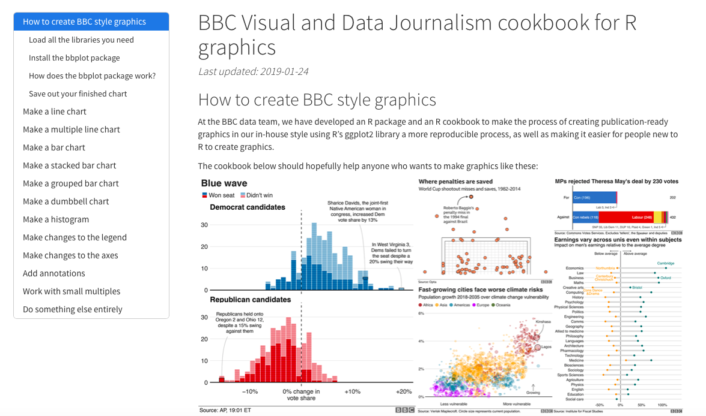
```
]

---
# World Happiness Data

```{r, echo=FALSE}
url1 <- "https://query.data.world/s/tw3oaknxjlqods27xzzbpa3do4rmfr"
p1f <- tempfile()
download.file(url1, p1f, mode="wb")
happy_data <- read_excel(path = p1f)
happy_data <- happy_data[1:6]
```
We can have a look at the World Happiness dataset that measures Happiness (called Life Ladder) and a bunch of other things (e.g., GDP) over countries over time.

.center[
```{r, fig.height=4}
vis_dat(happy_data)
```
]
---
.center[
```{r, fig.height=6}
vis_miss(happy_data)
```
]
---
.top[
```{r, echo=FALSE, fig.width=10, fig.height=4, message=FALSE}
happy_data %>% 
  group_by(country) %>%
  filter(!is.na(`Life Ladder`) & year == 2016) %>%
  summarise(score = `Life Ladder`) %>%
  mutate(country = reorder(country, score)) %>%
  top_n(20) %>%
  ggplot(aes(x = score, y = country)) + 
  geom_point() +
  labs(x = "Happiness Index Score", y = "Country", 
       title = "Top 20 Happiest Countries in 2016") +
  theme_tufte(base_size = 15) 
```
]
.bottom[
```{r, eval=FALSE}
happy_data %>% 
  group_by(country) %>%
  filter(!is.na(`Life Ladder`) & year == 2016) %>%
  summarise(score = `Life Ladder`) %>%
  mutate(country = reorder(country, score)) %>%
  top_n(20) %>%
  ggplot(aes(x = score, y = country)) + 
  geom_point() +
  labs(x = "Happiness Index Score", y = "Country", 
       title = "Top 20 Happiest Countries in 2016") +
  theme_tufte(base_size = 15) 
```
]
---
.top[
```{r, echo=FALSE, fig.width=10, fig.height=4}
country_list <- c("United Kingdom", "France", "Germany", 
                  "Italy", "Norway", "United States")
happy_data %>% 
  filter(country %in% country_list) %>%
  filter(!is.na(`Social support`)) %>%
  mutate(score = `Social support`) %>%
  mutate(country = reorder(country, score)) %>%
  ggplot(aes(y = score, x = country, fill = country)) + 
  geom_boxplot(width = .5) +
  labs(y = "Boxplot of Social support", x = "Country", 
       title = "Social support") +  
  guides(fill = FALSE) + 
  coord_flip() + theme_tufte(base_size = 15)
```
]
.bottom[
```{r, eval=FALSE}
country_list <- c("United Kingdom", "France", "Germany", 
                  "Italy", "Norway", "United States")
happy_data %>% 
  filter(country %in% country_list) %>%
  filter(!is.na(`Social support`)) %>%
  mutate(score = `Social support`) %>%
  mutate(country = reorder(country, score)) %>%
  ggplot(aes(y = score, x = country, fill = country)) + 
  geom_boxplot(width = .5) +
  labs(y = "Boxplot of Social support", x = "Country", 
       title = "Social support") +  
  guides(fill = FALSE) + 
  coord_flip() + theme_tufte(base_size = 15)
```
]
---
.top[
```{r, echo=FALSE, fig.width=10, fig.height=4}
happy_data %>% 
  filter(country %in% country_list) %>%
  group_by(country) %>%
  mutate(score = `Life Ladder`) %>%
  ungroup() %>%
  mutate(country = reorder(country, score)) %>%
  ggplot(aes(x = country, y = score)) + 
  geom_boxplot() +
  labs(x = "Country", y = "Happiness Index Score", 
       title = "Average Happiness Index for 6 Countries") +
  coord_flip() + theme_fivethirtyeight(base_size = 15)  
```
]
.bottom[
```{r, eval=FALSE}
happy_data %>% 
  filter(country %in% country_list) %>%
  group_by(country) %>%
  mutate(score = `Life Ladder`) %>%
  ungroup() %>%
  mutate(country = reorder(country, score)) %>%
  ggplot(aes(x = country, y = score)) + 
  geom_boxplot() +
  labs(x = "Country", y = "Happiness Index Score", 
       title = "Average Happiness Index for 6 Countries") +
  coord_flip() + theme_fivethirtyeight(base_size = 15)  
```
]
---
.top[
```{r, echo=FALSE, fig.width=10, fig.height=4}
country_list <- c("United Kingdom", "France", "Germany", 
                  "Italy", "Norway", "United States")
happy_data %>%
  filter(country %in% country_list) %>%
  group_by(year) %>%
  filter(!is.na(`Life Ladder`)) %>%
  ggplot(aes(x = year, y = `Life Ladder`)) +
  geom_line() +
  facet_wrap(~ country) +
  labs(x = "Year", y = "Happiness index", 
       title = "Happiness Index over Time for 6 Countries") +
  theme_fivethirtyeight(base_size = 15) +
  theme(axis.text.x = element_text(angle = 45, hjust = 1))
```
]
.bottom[
```{r, eval=FALSE}
country_list <- c("United Kingdom", "France", "Germany", 
                  "Italy", "Norway", "United States")
happy_data %>%
  filter(country %in% country_list) %>%
  group_by(year) %>%
  filter(!is.na(`Life Ladder`)) %>%
  ggplot(aes(x = year, y = `Life Ladder`)) +
  geom_line() +
  facet_wrap(~ country) +
  labs(x = "Year", y = "Happiness index", 
       title = "Happiness Index over Time for 6 Countries") +
  theme_fivethirtyeight(base_size = 15) +
  theme(axis.text.x = element_text(angle = 45, hjust = 1))
```
]
---
# Binder for fully reproducible computational environments

On the previous slides, we saw a number of example visualizations and 
associated code.  Open code is great, but we also need to ensure we share our
computational environment so our code can be re-run (and produce the same 
output).

We need to capture the versions of the different R packages we're using (plus 
their dependencies). 

May sound trivial but trying running some old R code and be amazed at how many 
things now don’t work as they once did!  

Many R packages have introduced 'breaking changes' when they have been updated. 


---
# Binder, BinderHub, and repro2docker

Binder is powered by BinderHub, which is an open-source tool that deploys the 
Binder service in the cloud.

Binder works by pulling a repository that you set up on GitHub into a 
Docker container.  Docker packages your data, code and all its dependencies in 
the form called a docker container to ensure that your application works 
seamlessly in any environment.

.center[
```{r, echo=FALSE, out.width="50%"}

```
]
---
class: middle, center

```{r, echo=FALSE, out.width="80%"}
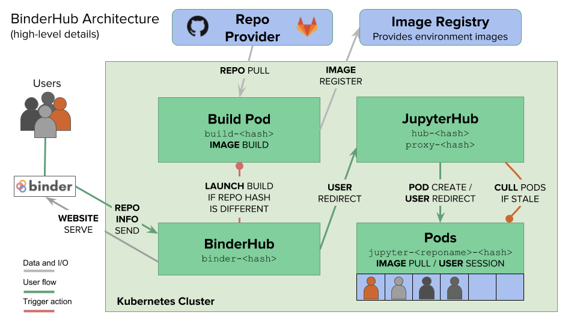
```

```{r, echo=FALSE}
knitr::include_graphics("images/thinking.gif")
```

---
class: middle, center

# But you don't need to worry about any of that!

---
# Step 1 - Set up a GitHub account

```{r, echo=FALSE}

```

---
# Step 2 - Create a new public repository

```{r, echo=FALSE}

```

---
# Step 3 - Upload your R script and data and make your first “Commit”

```{r, echo=FALSE}
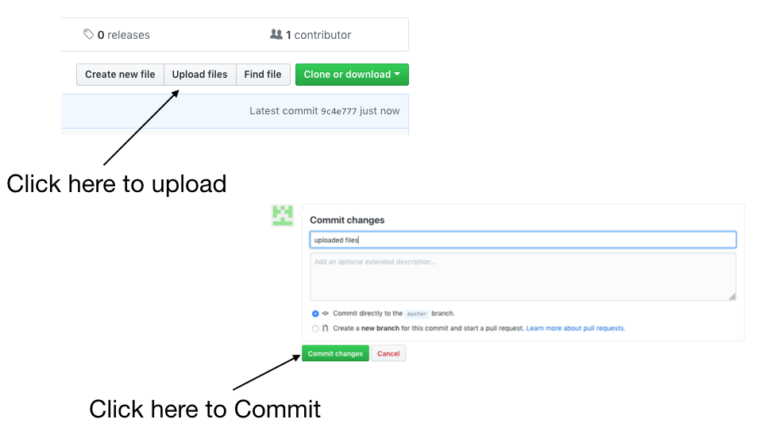
```

---
# Step 3 - Upload your R script and data and make your first “Commit”

We need two other files at this point - one is called “runtime.txt” and contains 
the date of R and its associated packages that you want to simulate.

The other is called “install.R” and contains the list of R packages that need to 
be installed in order for your script to run. 

To create a new file select “Create new file”.

```{r, echo=FALSE}
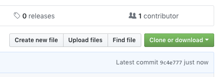
```

---

```{r, echo=FALSE}

```

---
# Step 5 - Now we need to link our repo to Binder (mybinder.org)

```{r, echo=FALSE}
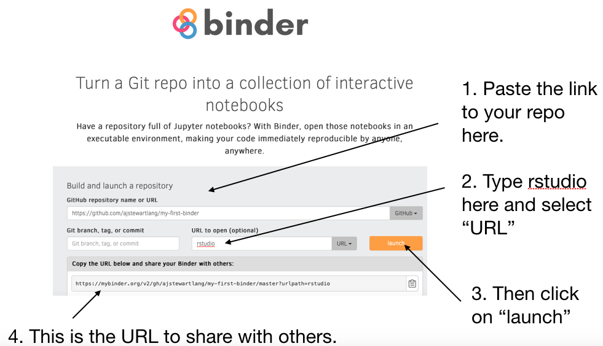
```

---
```{r, echo=FALSE}
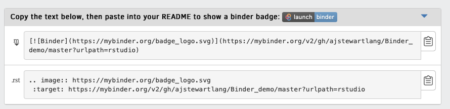
```

Paste the first bit of code into your GitHub repo README.md - you’ll then be 
able to click on the ‘launch binder’ button in your repository to launch the 
actual binder once it has been built - makes it easy for others to go from you 
GitHub repo to your code running in Binder.

---
# Once you click ‘Launch’…

```{r, echo=FALSE}
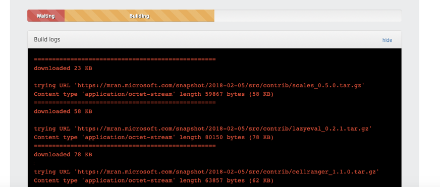
```

---
class: center, middle

```{r, echo=FALSE, out.width="150%"}

```

---
class: middle

If Binder can find an image that you’ve built previously, it will simply launch 
that.

If you’ve made changes to your GitHub repo, it will rebuild the Docker image and 
create a new Binder.

And then...

.center[
```{r, echo=FALSE, out.width="50%"}

```
]
---
# Ta da!
.center[
```{r, echo=FALSE, out.height="50%"}
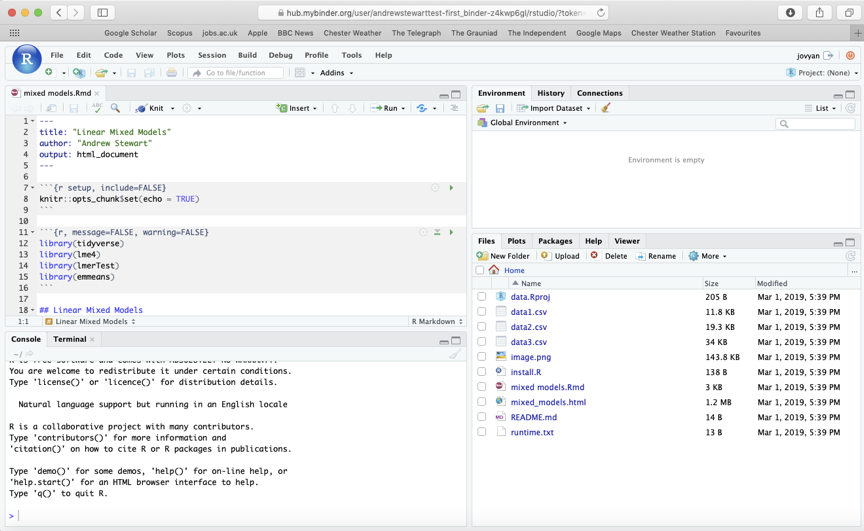
```
]

---
# A few key things...

Installing the entire Tidyverse in a Binder can take a long time - better to 
install only the packages you use (e.g., ggplot2, dplyr, readr etc.) - this 
will also ensure the packages are consistent with the date in your runtime.txt 
file.

Even with just a couple of packages it can take ~15 minutes or so for your 
Binder to be built.

Some R packages need system-level packages to also be installed - you can do 
that via an additional apt.txt file which lists those packages - this is used 
by apt-install to install those packages from the Ubuntu apt repository.

At the moment, you can’t change the version of R that runs on Binder (currently 
set to 3.4.4.) so need to go down the Rocker route but be aware that you may 
not get the right version of the packages that you want…

You can close your laptop if Binder is taking too long - the image and your 
Binder will continue to be built in the Cloud.  And it’s always a good excuse 
for another coffee…

---
# For Ultimate Reproducibility

Make sure you have updated all your packages before you run your script.

Build your Binder and specify the day you ran your analysis in the runtime.txt 
file.

Patience (young Skywalker) while your Binder builds…

---
# Now for your data visualization backwards coding challenge...

Ideally in groups (assuming a range of skill levels), generate R code that will
re-create each of the following visualizations.  The data are SNCF train data 
from a TidyTuesday.  All instructions for loading the data and the workshop are 
in the hackmd.io document below.

https://hackmd.io/wlp5EX3ATK2ZCqjnx9DKLg?view

After you have re-created each visualization, create a GitHub repo of your 
script, a runtime.txt file, and an install.R file.  Then create a Binder from 
your repo.  While your Binder is building, move onto the next visualization 
challenge.

At the end of the workshop, you should each have 6 R scripts, 6 new GitHub 
repositories, and a Binder associated with each of the 6 repositories.
---
# Visualization 1

```{r, echo=FALSE, warning=FALSE, message=FALSE}
full_trains <- read_csv("https://raw.githubusercontent.com/rfordatascience/tidytuesday/master/data/2019/2019-02-26/full_trains.csv")
```

.middle[
.center[
```{r, echo=FALSE, warning=FALSE, message=FALSE, fig.width=16, fig.height=10}
full_trains %>% 
  ggplot(aes(x = journey_time_avg)) +
  geom_histogram(bins = 20, alpha = .4, fill = "black") +
  labs(title = "Histogram of Average Journey Time for trains on the SNCF Network",
       x = "Journey Time (mins.)",
       y = "Number of Instances") +
  theme(text = element_text(size = 18)) 
```
]
]
---
# Visualization 2
.middle[
.center[
```{r, , echo=FALSE, warning=FALSE, message=FALSE, fig.width=16, fig.height=10}
full_trains %>% 
  ggplot(aes(x = journey_time_avg)) +
  geom_histogram(bins = 20, alpha = .2)  +
  geom_histogram(data = filter(full_trains, service == "National"), 
                 aes(x = journey_time_avg),
                 bins = 20, fill = "red", alpha = .5) +
  theme(text = element_text(size = 20)) +
  labs(title = "Histogram of Average Journey Time for trains on the SNCF Network",
       subtitle = "National Service trains highlighted in red",
       x = "Journey Time (mins.)",
       y = "Number of Instances")
```
]
]
---
# Visualization 3

.middle[
.center[
```{r, echo=FALSE, warning=FALSE, message=FALSE, fig.width=16, fig.height=10}
full_trains %>% 
  filter(str_detect(departure_station, "PARIS")) %>%
  mutate(departure_station = toTitleCase(tolower(departure_station))) %>%
  mutate(month = factor(month, levels = 1:12, labels = month.name)) %>%
  group_by(month, year, departure_station) %>%
  summarise(mean_num_of_canceled_trains = mean(num_of_canceled_trains, na.rm = TRUE)) %>%
  ggplot(aes(x = departure_station, 
             y = mean_num_of_canceled_trains,
             colour = departure_station)) +
  geom_jitter(width = .2, alpha = .6, size = 5, stroke = 1) +
  guides(colour = FALSE) +
  coord_flip() +
  labs(x = NULL, y = NULL, 
       title = "Cancelled Trains from Paris Railway Stations by Year",
       subtitle = "Average Number of Cancellations per Month") +
  theme(text = element_text(size = 25)) +
  scale_color_tableau() +
  facet_wrap(~ year) 
```
]
]
---
# Visualization 4

.middle[
.center[
```{r, echo=FALSE, message=FALSE, warning=FALSE, fig.width=16, fig.height=10}
full_trains_agg <- full_trains %>% 
  filter(str_detect(departure_station, "PARIS")) %>%
  mutate(departure_station = toTitleCase(tolower(departure_station))) %>%
  mutate(month = factor(month, levels = 1:12, labels = month.name)) %>%
  group_by(month, year, departure_station) %>%
  summarise(mean_num_of_canceled_trains = mean(num_of_canceled_trains, na.rm = TRUE)) 

full_trains_agg %>%  
  ggplot(aes(x = departure_station, 
             y = mean_num_of_canceled_trains)) +
  geom_jitter(aes(colour = departure_station), width = .2, 
              alpha = .6, size = 5, stroke = 1) +
  geom_label_repel(data = filter(full_trains_agg, 
                                 (year == 2018) & (month == "May" | 
                                                     month == "April" | 
                                                     month == "June")), 
                   aes(x = departure_station, 
                       y = mean_num_of_canceled_trains,
                       label = month), size = 7) +
  guides(colour = FALSE) +
  coord_flip() +
  labs(x = NULL, y = NULL, 
       title = "Cancelled Trains from Paris Railway Stations by Year",
       subtitle = "Average Number of Cancellations per Month - Strike Months in 2018 highlighted") +
  theme(text = element_text(size = 25)) +
  scale_color_tableau() +
  facet_wrap(~ year) 
```
]
]
---
# Visualization 5

.middle[
.center[
```{r, echo=FALSE, message=FALSE, warning=FALSE, fig.width=16, fig.height=10}
full_trains %>%
  filter(year == 2017) %>%
  filter(service == "International") %>%
  mutate(departure_station = toTitleCase(tolower(departure_station))) %>%
  mutate(departure_station = reorder(departure_station, num_late_at_departure)) %>%
  mutate(month = factor(month, levels = 1:12, labels = month.name)) %>%
  ggplot(aes(x = departure_station, y = num_late_at_departure, 
             colour = departure_station)) +
  geom_boxplot() +
  guides(colour = FALSE) +
  coord_flip() +
  labs(title = "International SNCF Trains Departing Late in 2017",
       subtitle = "By Departure Station")  +
  scale_color_colorblind() +
  theme_fivethirtyeight() +
  theme(text = element_text(size = 25)) 
```
]
]
---
# Visualization 6

.middle[
.center[
```{r, echo=FALSE, warning=FALSE, message=FALSE}
p <- full_trains %>%
  filter(service == "International" & year == 2017) %>%
  unite(journey, departure_station, arrival_station, sep = " - ") %>% 
  mutate(journey = toTitleCase(tolower(journey))) %>%
  mutate(month = factor(month, levels = 1:12, labels = month.name)) %>%
  mutate(image = "train.png") %>%
  group_by(journey) %>%
  arrange(month) %>% 
  mutate(cum_sum = cumsum((num_late_at_departure))) %>% 
  ggplot(aes(x = journey, y = cum_sum)) +
  geom_image(aes(image = image), size = .15) + 
  guides(colour = FALSE) +
  coord_flip() +
  labs(title = "Running Total of International SNCF Trains Departing Late", 
       subtitle = "{closest_state} 2017", 
       x = NULL, y = "Running Total of Trains Late at Departure") +
  theme_economist() +
  theme(text = element_text(size = 18))  +
  transition_states(states = month)  

animate(p, height = 500, width = 1000)

```
]
]
---
# For the animated plot (Visualization 6)...

In addition to the runtime.txt and install.R files, you will also need to create
an apt.txt file as the gganimate package requires a system level installation
of magick.  Create your apt.txt file in your GitHub repo as you would the 
runtime.txt file, and add the following lines:

```{r, eval=FALSE}
libmagick++-dev
cargo
```

Your install.R file will probably also need to include the following:

```{r, eval=FALSE}
install.packages("gganimate")
install.packages("ggimage")
install.packages("gifski")
install.packages("png")
```

But for now...
---
class: center, middle
```{r, echo=FALSE, out.width="75%"}
knitr::include_graphics("images/pooh.gif")
```